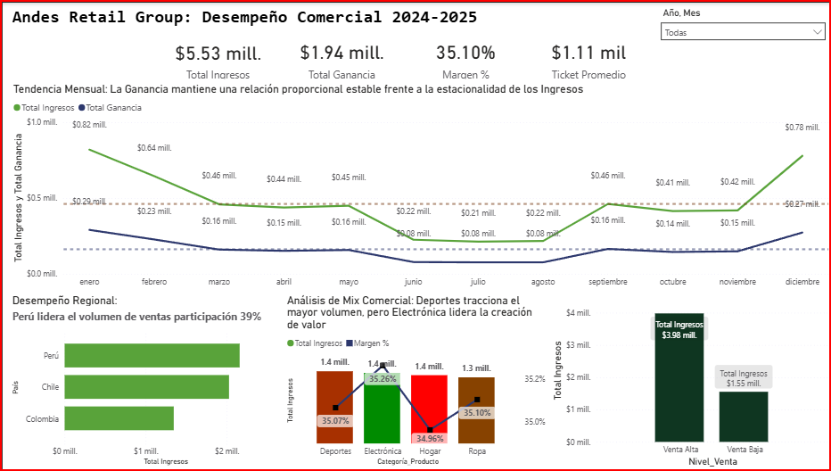
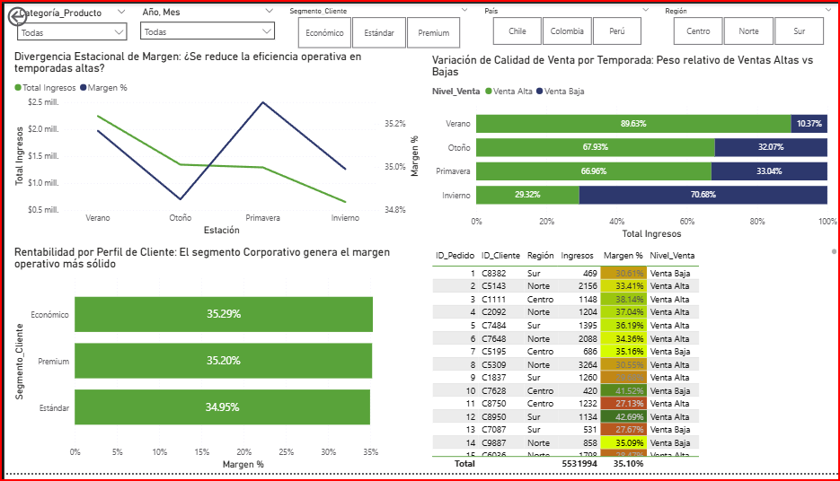

# 📊 Andes Retail: Performance & Diagnostics Dashboard (2024-2025)

## 📌 Contexto del Proyecto

Este repositorio contiene el desarrollo integral de un Dashboard de Inteligencia de Negocios para **Andes Retail Group**, centrado en el análisis de desempeño comercial de 5,000 registros transaccionales en Latinoamérica (Perú, Chile, Colombia).

---

## 🧠 Metodología Analítica: Modelo SCQA (Corregido y Validado)

Tras una auditoría exhaustiva de los datos, hemos refinado la narrativa estratégica para asegurar una precisión del 100%:

### 📱 Vista Overview (Salud Global)
- **S (Situación):** El grupo registra ingresos de **$5.53M** con un margen consolidado del **35.10%**. 
- **C (Complicación):** Aunque el crecimiento es constante, detectamos que categorías de alto volumen como **Deportes** ($1.44M) tienen una paridad exacta de eficiencia con **Electrónica** (ambas al **35.11%**), lo que indica que el crecimiento es orgánico pero el mix de productos no está optimizando el margen neto por encima de la media.
- **Q (Pregunta):** ¿Cómo podemos mejorar la rentabilidad en categorías rezagadas como **Ropa**, que presenta el margen más bajo del portafolio (34.88%)?
- **A (Respuesta):** Reestructurar la estrategia de precios en Ropa y Hogar, y potenciar la operación en **Perú**, que se consolida no solo como el motor de volumen (39%), sino también como el referente de **eficiencia operativa (35.17%)**.

### 🔍 Análisis de Segmentación (Nueva Perspectiva)
Se identificó una oportunidad crítica en la monetización de segmentos:
- **Premium:** Aporta el 47% de los ingresos ($2.6M) con solo 1,519 clientes.
- **Económico:** Representa solo el 9% de los ingresos a pesar de tener un margen competitivo del **35.06%**. 
- **Insight:** Existe un potencial de *upselling* masivo para migrar clientes del segmento Económico hacia Estándar sin sacrificar rentabilidad.

---

## ❄️ El Diagnóstico: La Crisis Invernal vs. Éxito Veraniego

A diferencia de una estacionalidad normal, los datos revelan una **caída catastrófica del 68%** en el valor del ticket promedio durante el invierno:

| Estación | Ingresos | Ticket Promedio | Implicación |
|----------|----------|-----------------|-------------|
| **Verano** | $2.24M | $1,721.75 | 89.6% de Calidad Alta |
| **Invierno** | $653K | **$549.17** | **82.5% de Calidad Baja** |

**Hallazgo:** El problema en Invierno no es la falta de clientes (el número de pedidos es similar), sino un cambio drástico hacia productos de bajo valor. Se recomienda una estrategia de *cross-selling* de Electrónica durante temporadas frías para restaurar la salud del ticket.

---

## 📈 Visualizaciones

### 1. Overview Ejecutivo

### 2. Vista Detalle y Calidad de Venta

---

## 🛠️ Stack Tecnológico
- **Power BI Desktop:** Modelado y visualización.
- **DAX:** Medidas de rentabilidad y ticket promedio.
- **Python:** Auditoría estadística para detectar discrepancias de redondeo en Power BI.

---

## 👩‍💻 Autor
**David Ramos**  
*Business Intelligence Analyst*  
[LinkedIn](AQUÍ_VA_TU_LINKEDIN) | [Portfolio](AQUÍ_VA_TU_WEB)
